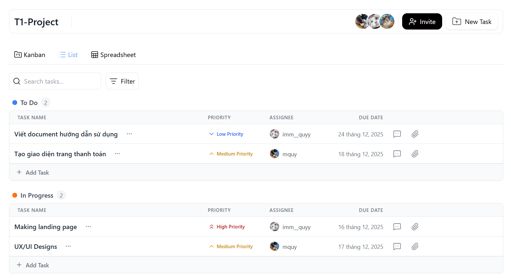
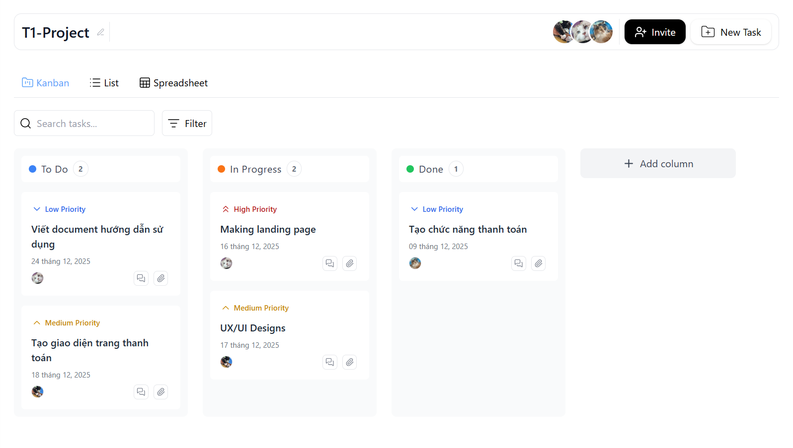
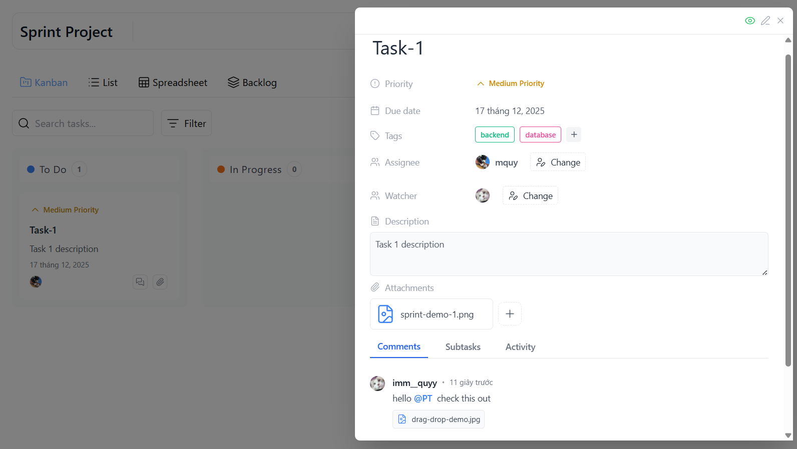
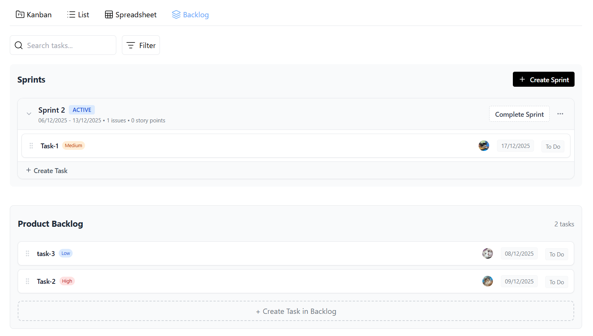

# Project Flow - Agile Management System
> Hệ thống quản lý dự án linh hoạt (Agile/Scrum) hỗ trợ AI, giúp tối ưu hóa quy trình làm việc nhóm.

[](https://localhost:7193)

## 1. Giới thiệu (Introduction)
Dự án được xây dựng nhằm giải quyết bài toán quản lý công việc trong các nhóm phát triển phần mềm, tập trung vào quy trình Scrum.
* **Mục tiêu:** Cung cấp công cụ trực quan để quản lý Backlog, Sprints, và theo dõi tiến độ qua Dashboard.
* **Điểm nổi bật:** Tích hợp **Google Gemini AI** để hỗ trợ viết mô tả công việc (User Stories) và gợi ý phân chia công việc tự động.
* **Bối cảnh:** Đồ án Chuyên ngành Công nghệ phần mềm.

## 2. Tính năng chính (Key Features)

### 📋 Quản lý Dự án & Sprint
- [x] Tạo và quản lý nhiều dự án.
- [x] **Sprint Lifecycle:** Lên kế hoạch (Planning), Thực hiện (Active), và Hoàn thành (Complete).
- [x] Tự động xử lý task chưa hoàn thành khi đóng Sprint (Move to Backlog/Next Sprint).

### 🛠 Quản lý Task (Công việc)
- [x] CRUD Task với đầy đủ thông tin: Priority, Due Date, Assignee.
- [x] **Kéo thả (Drag & Drop):** Tương tác trực quan trên Scrum Board và Backlog.
- [x] Phân chia Subtasks.
- [x] **Cộng tác:** Bình luận (Comments), đính kèm tệp (Attachments), và gắn thẻ (Tags).
- [x] **Lịch sử hoạt động:** Theo dõi chi tiết thay đổi (Activity Logs).

### 🤖 AI Powered (Google Gemini)
- [x] **Smart Description:** Tự động tạo mô tả chi tiết cho Task từ tiêu đề.
- [x] **Auto Breakdown:** Gợi ý chia nhỏ Task lớn thành các Subtasks.
- [x] **Estimation:** Hỗ trợ ước lượng Story Points.

### 🔐 Bảo mật & Quản trị
- [x] **Authentication:** Đăng ký/Đăng nhập bảo mật với JWT.
- [x] **Phân quyền:** Quản lý người dùng và quyền hạn (Admin/User).
- [x] **Notifications:** Thông báo cập nhật trạng thái công việc.

### 📊 Dashboard & Báo cáo
- [x] Biểu đồ thống kê tiến độ (Burn-down chart, Task distribution).
- [x] Thống kê workload của từng thành viên.

## 3. Công nghệ sử dụng (Tech Stack)

### Backend
* **Core:** C# - ASP.NET Core 8.0 Web API
* **Database:** SQL Server
* **ORM:** Entity Framework Core
* **Auth:** JWT Bearer Authentication / Identity
* **AI Integration:** Google Gemini API
* **Documentation:** Swagger UI / OpenAPI
* **Real-time:** SignalR (planned)

### Frontend
* **Core:** HTML5, Vanilla JavaScript (ES Modules)
* **Styling:** Tailwind CSS (v3 Custom Design), Lucide Icons
* **Components:** Custom Web Components, Vanilla Calendar Pro
* **Charts:** Chart.js

## 4. Hình ảnh Demo (Screenshots)

| Dashboard | Scrum Board |
|-----------|-------------|
|  |  |

| AI Assistant | Sprint Planning |
|--------------|-----------------|
|  |  |

## 5. Hướng dẫn cài đặt (Installation)

**Bước 1: Clone dự án**
```bash
git clone https://github.com/dogiaan611/DACN_ProjectManagement.git
cd DACN_ProjectManagement/ProjectManagement
```

**Bước 2: Cấu hình Database & Bảo mật**
* Cập nhật chuỗi kết nối (Connection String) trong `appsettings.json`.
* Thêm API Key cho Google Gemini và cấu hình SMTP Email (nên dùng User Secrets hoặc file `.env`).
```json
"ConnectionStrings": {
  "DefaultConnection": "Server=YOUR_SERVER;Database=ProjectManagementDB;..."
}
```

**Bước 3: Khởi tạo Database**
```bash
dotnet ef database update
```

**Bước 4: Cài đặt & Build Frontend (Tailwind CSS)**
```bash
npm install
npm run build:css
# Hoặc chạy chế độ watch khi dev
npm run watch:css
```

**Bước 5: Chạy ứng dụng**
```bash
dotnet run
```
Truy cập: `https://localhost:7193`

## 6. Đóng góp (Contributing)
Pull request are welcome. For major changes, please open an issue first to discuss what you would like to change.

## 7. License
[MIT](https://choosealicense.com/licenses/mit/)